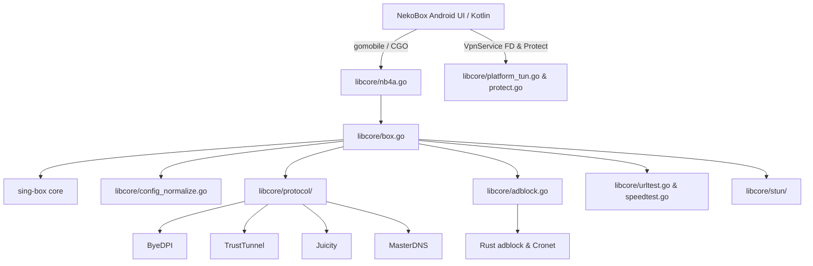

# Полный разбор Go-модуля libcore

## 1. Обзор и архитектурное назначение `libcore`

Модуль **`libcore`** является центральным высокопроизводительным прокси-ядром (proxy core) на языке **Go**, на котором базируется приложение NekoBox (как мобильная версия NekoBoxForAndroid, так и десктопные варианты). 

`libcore` связывает Java/Kotlin код Android-приложения (через `gomobile` / CGO биндинги) или CLI-клиент с низкоуровневой прокси-библиотекой [`sing-box`](https://github.com/sagernet/sing-box), расширяя её функционал кастомными протоколами, специфичными алгоритмами обхода DPI, продвинутым тестированием задержек, AdBlock-фильтрацией и платформенной интеграцией с Android OS.

### Ключевые зоны ответственности `libcore`:
1. **Жизненный цикл ядра sing-box**: инициализация, динамический запуск/остановка, горячий перезапуск конфигурации и логирование.
2. **Нормализация и конвертация профилей**: автоматическое преобразование разрозненных форматов подписок и конфигураций (V2Ray/VMess, VLESS, Shadowsocks, Trojan, Hysteria 1/2, TUIC, SSH, WireGuard и др.) в стандартизированный JSON-формат `sing-box`.
3. **Платформенная интеграция с Android**:
   - Передача файлового дескриптора `VpnService` TUN-интерфейса в gVisor/lwIP сетевой стек.
   - Защита исходящих сокетов от закольцовывания VPN-трафика через `VpnService.protect(fd)`.
   - Сопоставление сокетов с конкретными UID приложений Android для per-app VPN routing через `/proc/net`.
4. **Кастомные протоколы и обход DPI**:
   - **ByeDPI**: фрагментация пакетов TLS/HTTP и подмена SNI для обхода ТСПУ/DPI.
   - **TrustTunnel** (включая встроенную библиотеку `sing-trusttunnel`): прокси поверх QUIC, Cronet и TLS с ротацией ALPN и защитой от обрывов.
   - **Juicity**: прокси-протокол поверх QUIC.
   - **MasterDNS VPN**: туннелирование трафика через DNS-запросы.
5. **Диагностика сети и выбор узлов**:
   - Параллельное измерение задержки (HTTP/TCP URLTest, ICMP Ping).
   - Измерение скорости (Speedtest: download & upload throughput).
   - STUN NAT discovery: определение типа NAT (Full Cone, Restricted Cone, Symmetric NAT).
6. **Фильтрация трафика и AdBlock**:
   - Работа с базами GeoIP / Geosite (`.dat` и `.srs`).
   - Модуль блокировки рекламы `adblock.go` на базе Rust `adblock-rust` и Google Cronet.

---

## 2. Полный разбор файлов и поддиректорий `libcore`

### 2.1. Корневой каталог `libcore/`

| Имя файла | Описание и назначение |
| :--- | :--- |
| `adblock.go` | Модуль фильтрации рекламы и трекеров. Интегрирует Rust-библиотеку `adblock-rust` и Google Cronet для перехвата и блокировки DNS-запросов и HTTP(S) URL. |
| `assets.go` | Менеджер путей и загрузки системных ресурсов (баз GeoIP/Geosite, списков правил, X.509 сертификатов). |
| `assets_android.go` | Извлечение встроенных ресурсов из Android APK (`assets/`) во внутреннее/внешнее хранилище устройства. |
| `assets_other.go` | Заглушка (stub) менеджера ресурсов для desktop/non-Android систем. |
| `box.go` | Главный контроллер экземпляра `sing-box`. Управляет запуском, остановкой, перезагрузкой конфигурации, сбором статистики трафика и статусом подключения. |
| `box_include.go` | Импорт и регистрация стандартных протоколов, inbound/outbound модулей и DNS-транспортов `sing-box`. |
| `box_include_naive.go` | Компиляционное подключение outbound-протокола NaiveProxy (включается тегом сборки `with_naive_outbound`). |
| `box_include_naive_stub.go` | Заглушка для NaiveProxy при сборке без поддержки NaiveProxy. |
| `build.sh` | Shell-скрипт компиляции `libcore` через `gomobile` в AAR-архив и `.so` библиотеки для Android. |
| `byedpi_validate.go` | Валидатор параметров конфигурации ByeDPI (проверка опций сплиттинга пакетов, фальшивых SNI и смещения). |
| `certs.go` | Загрузка и валидация X.509 сертификатов, добавление пользовательских Root CA в системный пуп сертификатов. |
| `clash_mode.go` | Управление режимами глобальной маршрутизации в стиле Clash (`Direct`, `Global`, `Rule`). |
| `clash_mode_test.go` | Unit-тесты переключения режимов Clash. |
| `config_normalize.go` | Основной конвертер конфигураций: преобразует профили NekoBox в валидный JSON-конфиг для `sing-box`. |
| `config_normalize_test.go` | Unit-тесты парсинга и конвертации различных форматов прокси-конфигураций. |
| `country_lookup_test.go` | Unit-тесты сопоставления IP-адресов с двухбуквенными кодами стран (ISO). |
| `crashtools.go` | Перехват фатальных паник (panic recovery), форматирование стектрейсов и предотвращение внезапных крашей приложения. |
| `crashtools_cgo.go` | Обработчик сбоев и сигналов на уровне CGO и C-библиотек. |
| `crashtools_cgo_stub.go` | Заглушка обработчика CGO-ошибок для платформ без CGO. |
| `crypto.go` | Криптографические утилиты (генерация случайных ключей, хэширование). |
| `dns_android.go` | Интеграция системного DNS-резолвера Android (`android_getaddrinfo` / Java InetAddress). |
| `dns_box.go` | Мост между DNS-модулем `sing-box` и системными/кастомными DNS-транспортами (DoH, DoT, DoQ). |
| `dns_local.go` | Локальный DNS-транспорт для вызова системного резолвера OS. |
| `dup_unix.go` | Кроссплатформенное дублирование файловых дескрипторов сокетов (`dup`) для Unix/Android. |
| `dup_windows.go` | Реализация дублирования сокетов (`WSADuplicateSocket`) для Windows. |
| `fix.go` | Monkey-patching и исправления несовместимостей в рантайме Go или сторонних зависимостях. |
| `genproto_workaround.go` | Устранение конфликтов дублирования типов Protobuf при сборке CGO. |
| `geo_dat_test.go` | Unit-тесты чтение традиционных GeoIP/Geosite `.dat` файлов. |
| `geo_suggestions.go` | Генерация предложений правил маршрутизации на основе анализа трафика и гео-баз. |
| `geoip.go` | Парсер и инспектор GeoIP баз данных (`.srs` и `.dat` форматов) для поиска стран и CIDR IP-диапазонов. |
| `geosite.go` | Парсер и инспектор Geosite баз данных (`.srs` и `.dat` форматов) для поиска списков доменов. |
| `go.mod` | Файл управления зависимостями Go-модуля (указывает на `sing-box`, `libneko`, `amneziawg-go` и др.). |
| `go.sum` | Контрольные суммы (хеши) всех внешних Go-зависимостей. |
| `group_urltest.go` | Логика групп серверов (URLTest/Selector/Fallback): авто-тестирование задержек и выбор наилучшего нода. |
| `group_urltest_test.go` | Unit-тесты работы динамических групп прокси-серверов. |
| `http.go` | Вспомогательный HTTP-клиент для скачивания подписок, правил и ресурсов через прокси или напрямую. |
| `http_cancel_test.go` | Тестирование корректного отзыва и отмены зависших HTTP-запросов. |
| `http_test.go` | Unit-тесты для HTTP-клиента. |
| `http_utls.go` | HTTP-транспорт с поддержкой библиотеки `uTLS` для имитации TLS-отпечатков браузеров (Chrome, Firefox, Safari). |
| `icmp_ping.go` | Прямой замер RTT задержки через отправку сырых ICMP Echo пакетов. |
| `icmp_ping_test.go` | Unit-тесты ICMP пинга. |
| `init.sh` | Скрипт инициализации исходников и окружения. |
| `interface_monitor.go` | Отслеживание изменений сетевых интерфейсов OS (переключение с Wi-Fi на LTE, изменение IP адресов). |
| `interface_monitor_test.go` | Unit-тесты монитора сетевых интерфейсов. |
| `io.go` | Оптимизированное буферизованное копирование потоков данных и управление пулом байтовых буферов. |
| `masque_cache.go` | Кэширование состояния и токенов авторизации для соединения по протоколу MASQUE (HTTP/3 proxy). |
| `memory.go` | Мониторинг использования ОЗУ, контроль за потреблением памяти и вызов сборщика мусора (`runtime.GC()`). |
| `nb4a.go` | Главная точка входа CGO/gomobile для NekoBoxForAndroid: инициализация логов, Java-интерфейсов и защитников сокетов. |
| `pc.go` | Специфичные функции и точки входа для запуска `libcore` на ПК (Windows/Linux/macOS). |
| `platform_box.go` | Реализация системных платформ-зависимых сервисов для ядра `sing-box`. |
| `platform_box_test.go` | Unit-тесты платформенных сервисов. |
| `platform_java.go` | Определение Go-интерфейсов для вызова методов Java/Kotlin (`NB4AInterface`, `BoxPlatformInterface`). |
| `platform_tun.go` | Управление TUN-интерфейсом Android: захват сокета VPN, проброс пакетов в gVisor/lwIP. |
| `platform_tun_test.go` | Unit-тесты для TUN-модуля. |
| `profiler.go` | Встроенный Pprof профилировщик для снятия дампов CPU, памяти и активных горутин. |
| `profiler_test.go` | Unit-тесты профилировщика. |
| `protect.go` | Менеджер защиты сокетов: вызывает `VpnService.protect(fd)` для предотвращения закольцовывания трафика. |
| `protect_unix.go` | Передача сокета через Unix Domain Socket на Android для выполнения `protect`. |
| `protect_windows.go` | Заглушка защиты сокетов для Windows. |
| `routing_rules_cache.go` | Быстрый in-memory кэш результатов проверки правил маршрутизации (ускоряет роутинг доменов). |
| `routing_rules_cache_test.go` | Unit-тесты кэша результатов проверки правил маршрутизации. |
| `ruleset_match.go` | Сопоставление сетевого трафика с правилами из файлов `.srs` (sing-box RuleSet). |
| `ruleset_match_test.go` | Unit-тесты матчера RuleSet. |
| `speedtest.go` | Движок измерения скорости интернета (download/upload throughput) через выбранный outbound. |
| `speedtest_test.go` | Unit-тесты модуля измерения скорости. |
| `ssh_host_key.go` | Валидация и проверка публичных SSH-ключей серверов для исходящих SSH-туннелей. |
| `ssh_host_key_test.go` | Unit-тесты проверки SSH-ключей. |
| `storage_maintenance.go` | Обслуживание хранилища: очистка старых логов, временных файлов и оптимизация БД. |
| `storage_maintenance_test.go` | Unit-тесты обслуживания хранилища. |
| `stun.go` | Вспомогательный модуль для запуска STUN-запросов и проверки NAT. |
| `stun_test.go` | Unit-тесты модуля STUN. |
| `tools.go` | Теги сборки Go для тулинга разработчика. |
| `trusttunnel.go` | Интеграционный адаптер для outbound-протокола TrustTunnel. |
| `trusttunnel_test.go` | Unit-тесты TrustTunnel адаптера. |
| `uid_unix.go` | Определение UID процесса в Linux/Android для раздельной маршрутизации приложений (per-app VPN). |
| `uid_windows.go` | Заглушка определения UID для Windows. |
| `urltest.go` | Параллельное тестирование задержки (Latency/RTT) отдельных прокси-серверов по HTTP/TCP. |
| `urltest_test.go` | Unit-тесты модуля замера задержек. |
| `v2geo.go` | Конвертер традиционных GeoIP/Geosite `.dat` файлов в компактный формат `.srs`. |
| `versions.go` | Экспорт версий ядра `libcore`, `sing-box` и даты сборки в интерфейс приложения. |
| `versions_test.go` | Unit-тесты экспорта версий. |
| `Dockerfile.plus` | Контейнер сборщика `libcore` с полным окружением (Go, Rust, Cronet, Clang/LLD). |
| `LICENSE` | Текст открытой лицензии (GPL-3.0). |

---

## 2.2. Поддиректория `cmd/`

- **`cmd/cli/main.go`**: Точка входа для сборки консольной утилиты `nekobox-cli`. Позволяет запускать прокси-ядро `libcore` в автономном режиме на Linux/Windows/macOS без использования Android GUI.

---

## 2.3. Поддиректория `device/`

- **`device/device.go`**: Сбор сведений о железных характеристиках устройства (архитектура CPU, количество ядер, доступная ОЗУ, OS version).
- **`device/debug.go`**: Вспомогательные функции для глубокой отладки, безопасной перехватки паник в горутинах и логирования трассировки стека.

---

## 2.4. Поддиректория `ech/`

- **`ech/ech.go`**: Реализация поддержки Encrypted Client Hello (ECH / ESNI). Извлекает ECH-конфигурации из DNS HTTPS-записей и настраивает TLS-клиенты для скрытия SNI на уровне шифрования TLS 1.3.

---

## 2.5. Поддиректория `masterdnsvpnbridge/`

- **`masterdnsvpnbridge/progress.go`**: Мост обратного вызова для передачи прогресса поиска и инициализации рабочих DNS-серверов в MasterDNS VPN обратно в пользовательский интерфейс Android.

---

## 2.6. Поддиректория `procfs/`

- **`procfs/procfs.go`**: Чтение и сопоставление сетевых сокетов с файловой системой `/proc/net/tcp` и `/proc/net/udp` на Linux/Android. Используется для точного определения Android UID приложения, создавшего сокет, с целью реализации выборочного шлюзования приложений (Per-App Proxy / VPN).

---

## 2.7. Поддиректория `protect/`

- **`protect/protect.go`**: Центральный реестр функций защиты сокетов (`Protect`). Регистрирует функции обратного вызова, оберегающие сокеты самого NekoBox от попадания в создаваемый им же TUN-интерфейс.

---

## 2.8. Поддиректория `protocol/` (Кастомные прокси-протоколы)

Директива `protocol/` содержит собственные реализации outbound-протоколов обхода блокировок:

#### 2.8.1. `protocol/byedpi/` (Обход DPI через сплиттинг пакетов)
- `args.go`, `args_test.go`: Парсинг и проверка параметров ByeDPI (опции разбиения пакетов, фальшивый SNI, смещение).
- `bridge.go`, `bridge_stub.go`: CGO-мост для связи Go-кода с C-библиотекой ByeDPI.
- `byedpi_bridge.c`, `byedpi_lib.c`: C-исходники оригинальной библиотеки ByeDPI для фрагментации TCP/TLS пакетов.
- `options.go`, `outbound.go`, `outbound_test.go`: Интеграция ByeDPI в качестве исходящего протокола (outbound) для `sing-box`.

#### 2.8.2. `protocol/juicity/` (Протокол Juicity over QUIC)
- `outbound.go`: Outbound-клиент протокола Juicity, работающий поверх устойчивого к потерям QUIC-соединения.

#### 2.8.3. `protocol/masterdnsvpn/` (DNS-туннелирование)
- `log.go`, `options.go`, `outbound.go`: Реализация исходящего туннеля, передающего пользовательские данные через зашифрованные DNS-запросы (MasterDNS VPN).

#### 2.8.4. `protocol/trusttunnel/` и `sing-trusttunnel/`
Расширенная система туннелирования TrustTunnel:
- `protocol/trusttunnel/options.go`, `outbound.go`, `outbound_ping_gvisor.go`, `outbound_ping_stub.go`: Outbound-клиент TrustTunnel для `sing-box`.
- **`protocol/trusttunnel/sing-trusttunnel/`** (Полная встроенная библиотека TrustTunnel):
  - `client.go`, `client_transport.go`: Основной клиент протокола TrustTunnel.
  - `client_cronet.go`, `client_cronet_unix.go`, `client_cronet_stub.go`, `client_cronet_socket_stub.go`: Транспорт поверх Chromium Cronet для обхода блокировок на уровнях протокола HTTP/3 / QUIC.
  - `client_random.go`, `client_alpn_test.go`: Ротация ALPN и рандомизация заголовков соединения.
  - `client_recovery_test.go`, `passive_recovery.go`: Алгоритмы пассивного восстановления соединения при обрывах.
  - `close_tracker.go`, `close_tracker_test.go`: Трекинг закрытия сокетов и очистки ресурсов.
  - `force_close.go`: Принудительный разрыв сокетов по таймауту.
  - `icmp.go`, `packet.go`, `protocol.go`, `quic.go`, `quic_stub.go`: Формирование пакетов TrustTunnel, поддержка QUIC и низкоуровневая сборка трафика.
  - `cmd/sing-trusttunnel/*`: Автономная CLI-утилита `sing-trusttunnel` (`main.go`, `client.go`, `log.go`, `options.go`, `service.go`, `url.go`).
  - `tturl/url.go`, `tturl/url_test.go`: Парсинг и генерация спецификации URL-ссылок вида `trusttunnel://`.

---

## 2.9. Поддиректория `stun/` (Модуль STUN & NAT Discovery)

Встроенный клиент протокола STUN (Session Traversal Utilities for NAT) для определения типа NAT и внешней адресации:

| Имя файла | Описание и назначение |
| :--- | :--- |
| `attribute.go` | Кодирование и декодирование атрибутов STUN-сообщений (MAPPED-ADDRESS, XOR-MAPPED-ADDRESS, ERROR-CODE и др.). |
| `client.go` | Управление клиентом STUN: выполнение запросов к STUN-серверам и обработка тайм-аутов. |
| `const.go` | Константы протокола STUN (Magic Cookie `0x2112A442`, заголовки, типы сообщений). |
| `discover.go` | Алгоритм обнаружения NAT-топологии (определение типов: Full Cone, Restricted Cone, Port Restricted, Symmetric NAT). |
| `doc.go` | Документация пакета STUN. |
| `host.go` | Разрешение IP-адресов STUN-серверов. |
| `log.go` | Логирование транзакций STUN-клиента. |
| `net.go` | Работа с UDP/TCP сокетами для отправки и приёма STUN-пакетов. |
| `packet.go` | Парсинг и сборка заголовков и полезной нагрузки STUN-пакетов. |
| `response.go` | Разбор и обработка ответов от STUN-серверов. |
| `tcp.go` | Поддержка работы STUN через TCP-протокол. |
| `tests.go` | Процедуры проведения встроенного тестирования STUN. |
| `tolerance_test.go` | Unit-тесты устойчивости STUN-клиента к потерям пакетов и повторным отправкам. |
| `utils.go` | Вспомогательные байтовые операции для STUN. |
| `LICENSE`, `README` | Лицензия и документация пакета STUN. |

---

## 3. Сводная схема связей компонентов

